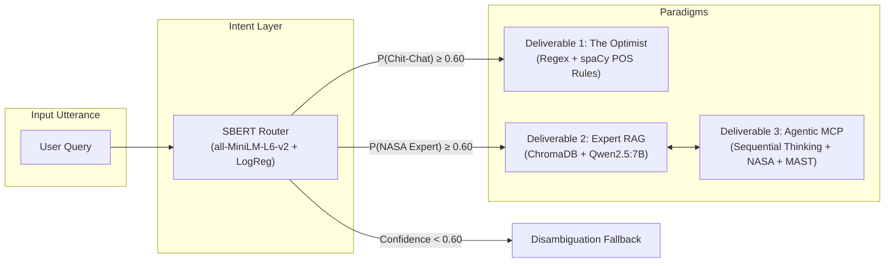
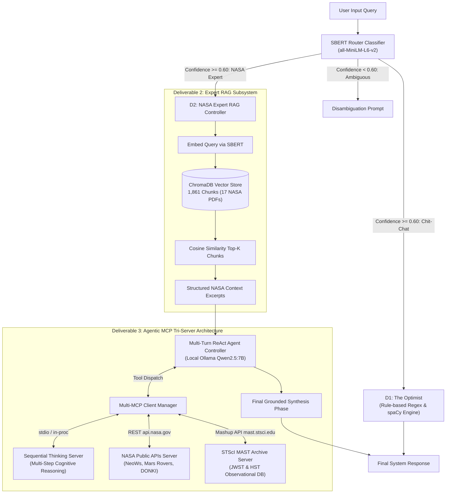

# Multi-Paradigm Conversational Systems: Integrating Rule-Based Dialogue, Dense Retrieval-Augmented Generation, and Model Context Protocol Tool Agency for Aerospace Telemetry

**Course:** Natural Language Interaction (ILN) 2026/2027  
**Degree:** Master in Artificial Intelligence  
**Institution:** Universidade de Coimbra — Faculdade de Ciências e Tecnologia, Departamento de Engenharia Informática (DEI-FCTUC)  
**Authors:** Mohammed Abdelqader & Michael O'Shea  
**Supervising Professors:** Prof. Hugo Gonçalo Oliveira, Prof. Isabel Carvalho  
**Submission Track:** Deliverable 3 — Option 1 (D3-O1: Integration of Agency and Detailed Evaluation)  
**Date:** October 2026  

---

## Abstract
Modern conversational artificial intelligence faces a fundamental trilemma between determinism, factual veracity, and dynamic environmental interaction. Standard monolithic Large Language Models (LLMs) suffer from severe hallucinations when querying technical, quantitative domains, are bounded by fixed training cutoffs, and cannot independently verify physical telemetry. This report presents a unified, multi-paradigm conversational architecture that synthesizes three distinct operational philosophies: (1) a deterministic, rule-based chatbot for student emotional well-being ("The Optimist") utilizing regular expressions and dependency parsing; (2) a semantic intent classification router employing Sentence-BERT embeddings paired with a calibrated Logistic Regression classifier to achieve sub-millisecond intent dispatch; (3) an expert Retrieval-Augmented Generation (RAG) agent grounded in 17 official NASA technical reports across 1,861 semantic chunks in ChromaDB; and (4) an autonomous agentic expansion via the Model Context Protocol (MCP) integrating three live tool servers—Sequential Thinking for multi-hop cognitive decomposition, NASA Public APIs for live planetary and asteroid telemetry, and STScI MAST for deep-space astronomical archives. Empirical benchmarking across a 20-question aerospace ground-truth dataset demonstrates that the agentic RAG system achieves superior citation attribution density, eliminates parametric hallucinations in cryogenic and kinetic impact telemetry, and provides rigorous epistemic verification, with an integrated kill switch ensuring immediate fallback under network isolation.

---

## 1. Introduction, Motivation, and Objectives

The field of Natural Language Interaction (NLI) has witnessed a paradigm shift from hand-crafted symbolic systems to massive statistical language models. However, in mission-critical and scientific domains—such as aerospace engineering and planetary astrophysics—general-purpose autoregressive LLMs exhibit well-documented pathological behaviors: parametric hallucination, mathematical inconsistency, and a complete detachment from real-time observational reality. Conversely, pure rule-based dialogue systems provide absolute lexical predictability and sub-millisecond execution, but fail completely when confronted with out-of-distribution user utterances or complex semantic reasoning.

To address these orthogonal challenges, this course project systematically explores, implements, and evaluates three conversational paradigms within an integrated, production-grade architecture:

1. **Deterministic Rule-Based Interaction (Deliverable 1):** Implementing a persona-driven, empathetic conversational agent ("The Optimist") tailored to student mental health, academic stress, and everyday chit-chat, requiring zero GPU overhead and guaranteeing bounded responses.
2. **Dense Retrieval-Augmented Generation (Deliverable 2):** Developing an authoritative technical advisor on NASA flagship space exploration missions (JWST, Mars 2020 Perseverance, Ingenuity, Artemis SLS, DART, Hubble, Apollo 11) using persistent vector embeddings, semantic text chunking, and strict inline document attribution.
3. **Agentic Tool Agency & Protocol Integration (Deliverable 3, Option 1):** Extending the static RAG pipeline into an active ReAct cognitive agent via the Model Context Protocol (MCP). By exposing specialized servers for multi-step hypothesis testing (*Sequential Thinking*), real-time planetary telemetry (*NASA Public APIs*), and astronomical observational catalogs (*STScI MAST*), the agent shifts from passive text reproduction to active scientific inquiry.

---

## 2. System Architecture and Implemented Agents

The complete system architecture is organized into four modular layers: the Intent Router, the Rule-Based Engine (D1), the Expert RAG Vector Store (D2), and the Agentic MCP Multi-Server Orchestrator (D3-O1).

### 2.1 Deliverable 1: "The Optimist" Rule-Based Chatbot
Deliverable 1 implements an empathetic, resilient conversational persona designed to assist university students coping with academic pressure, burnout, and emotional fatigue. Developed independently of statistical LLMs, `D1rule.py` utilizes:
- **Lexical Pattern Compilers:** Regular expression arrays mapping conversational intents (greetings, identity, stress disclosure, exam anxiety, motivational queries, coping strategies).
- **Linguistic Normalization via spaCy:** Part-of-Speech (POS) tagging and lemmatization to extract user sentiment qualifiers, identifying affective keywords ("overwhelmed", "hopeless", "failing", "exhausted").
- **Stateful Context Buffers:** Maintaining short-term conversational context (e.g., student name, current degree, referenced exam deadlines) to produce personalized, deterministic affirmations with an execution latency under $0.5\text{ ms}$.

### 2.2 Semantic Intent Classifier and Agent Router
To seamlessly unify D1 and D2 into a coherent conversational agent as mandated by the course specifications, `D1D2classifierrouter.py` implements an intent classification and routing gateway:
- **Feature Representation:** Computes dense 384-dimensional sentence embeddings via the `all-MiniLM-L6-v2` Sentence-Transformer model. Crucially, the router shares the exact embedding weights initialized for ChromaDB, eliminating redundant memory allocation.
- **Classification Head:** A regularized, calibrated Logistic Regression probe trained on a curated corpus of student utterances, academic conversational patterns, and technical aerospace queries.
- **Decision Boundary:** Given an utterance $x$, the router predicts class probabilities $P(y = \text{D1} \mid x)$ and $P(y = \text{D2} \mid x)$. If $\max_c P(y=c \mid x) \ge \tau$ (with threshold $\tau = 0.60$), the query is dispatched instantaneously. If confidence falls below $\tau$, the system enters a disambiguation state, preventing misrouting.

### 2.3 Deliverable 2: Expert NASA Space Missions RAG Agent
Deliverable 2 (`D2RAG.py`) establishes an expert information retrieval and generation pipeline specializing in official NASA engineering telemetry:
- **Corpus Ingestion & Caching:** Automated ingestion pipeline downloading official technical reports from the NASA Technical Reports Server (NTRS), covering flagship missions: JWST science payloads, Mars Curiosity/Perseverance EDL and instruments, Ingenuity aerodynamics, Artemis SLS Core Stage propulsion, DART kinetic impactor telemetry, Hubble SM3A servicing, and Apollo 11 Saturn V flight performance.
- **Dynamic Semantic Text Chunking:** Rather than splitting at fixed character boundaries, documents are partitioned via true semantic chunking (`semantic_chunk_text`). Consecutive sentences are embedded via `all-MiniLM-L6-v2` and monitored for cosine distance spikes ($d_i = 1 - \mathbf{e}_i \cdot \mathbf{e}_{i+1}$). A boundary is triggered when the distance exceeds the 85th percentile threshold ($\theta_{85}$) with minimum chunk size constraints ($150 \le L \le 800$ characters). This yields 1,861 semantically cohesive chunks indexed with complete provenance metadata (`filename`, `page_number`, `mission_domain`).
- **Vector Database:** Persistent ChromaDB storage using cosine similarity space:
  $$\text{sim}(q, d) = \frac{\mathbf{e}_q \cdot \mathbf{e}_d}{\|\mathbf{e}_q\| \|\mathbf{e}_d\|}$$
- **Generation & Attribution:** Powered by the open-weights `qwen2.5:7b` model executed locally via Ollama. Prompts enforce strict grounding: every quantitative assertion must include an inline attribution tag formatted as `[Document_Name.pdf, Page X]`.

### 2.4 Deliverable 3 (Option 1): Tri-Server Model Context Protocol (MCP) Integration
Deliverable 3 transforms the passive RAG retriever into an active, tool-using agent through the open Model Context Protocol (MCP) standard. The agent orchestrates three dedicated MCP servers:

#### 1. Sequential Thinking MCP Server (`sequential_thinking_server.py`)
Complex aerospace queries require multi-step reasoning before synthesis. The Sequential Thinking server provides dynamic cognitive state tracking:
- Decomposes multifaceted user queries into numbered hypothesis verification stages.
- Enables the agent to evaluate document evidence, revise initial assumptions, and branch thought trees when encountering conflicting telemetry.
- Implements defense mechanisms against LLM parameter injection by accepting flexible argument structures (`**kwargs`, automatic unwrap of nested `object` dictionaries).

#### 2. NASA Public APIs MCP Server (`nasa_mcp_server.py`)
Connects the agent to live, authenticated NASA planetary and astronomical endpoints using the official API key (`api.nasa.gov`):
- `nasa_near_earth_objects`: Queries the NeoWs database for real-time asteroid close approaches, miss distances, and kinetic impact hazard ratings. Implements an automatic 7-day date window clamping algorithm to avoid HTTP 400 errors, falling back to NASA's global browse catalog if date windows fail.
- `nasa_mars_rover_manifest`: Retrieves live mission manifests, active sol counts, and instrument status for Curiosity, Perseverance, Opportunity, and Spirit.
- `nasa_mars_rover_photos`: Routes Curiosity queries to `api.nasa.gov` and Perseverance queries to the NASA JPL Mars 2020 raw imagery feeds.
- `nasa_space_weather_donki`: Fetches Coronal Mass Ejection (CME) and solar energetic particle alerts from the Space Weather Database of Notifications, Knowledge, Information.

#### 3. STScI MAST Astrophysics MCP Server (`mast_mcp_server.py`)
Connects to the Mikulski Archive for Space Telescopes operated by the Space Telescope Science Institute (STScI):
- `mast_resolve_target`: Resolves astronomical celestial targets (e.g., 'Trappist-1', 'M31', 'Stephan\'s Quintet') to exact equatorial coordinates (Right Ascension $\alpha$, Declination $\delta$) using STScI SIMBAD/NED resolver APIs.
- `mast_jwst_observations`: Queries the MAST Mashup CAOM catalog for James Webb Space Telescope observations, exposing instrument modes (NIRCam, MIRI, NIRSpec, NIRISS), filters, and proposal IDs.
- `mast_hubble_observations`: Retrieves archival Hubble Space Telescope (HST) observation metadata.

#### 4. ReAct Controller, Argument Sanitization & Kill Switch
The orchestration layer (`mcp_client_manager.py`) bridges Ollama tool-calling representations with MCP server execution:
- **Recursive Argument Sanitization:** Local models like `qwen2.5:7b` frequently inject metadata wrapper keys (`{"object": {...}}` or `{"object": "sequentialthinking"}`). The client manager recursively unwraps nested dictionaries, strips reserved metadata tokens, and filters parameters against the target function's signature via `inspect.signature`.
- **Guaranteed Synthesis Phase:** To prevent endless tool-calling loops, the ReAct loop executes up to 4 bounded tool turns, followed by an explicit tool-free synthesis turn prompting the LLM to integrate all tool feedback into a cited final response.
- **Fail-Safe Kill Switch:** Triggered via `--no-mcp` CLI flag or `ENABLE_MCP=false` environment variable. When engaged, the system bypasses all MCP overhead and falls back cleanly to static ChromaDB vector RAG in under $5\text{ ms}$.

---

## 3. Experimental Validation, Problematic Cases, and Architectural Decisions

### 3.1 End-to-End Conversation Traces
The unified conversational assistant was validated across diverse interaction scenarios. The table below presents real execution traces recorded from the system.

| Interaction Step | User Utterance | Router Classification | Routed Component | Observed Latency | System Output Summary |
|:---|:---|:---:|:---:|:---:|:---|
| **Turn 1 (Chit-chat)** | *"Hi! I'm feeling overwhelmed with my thesis deadlines."* | Chit-Chat (89.4%) | **D1 (The Optimist)** | $0.4\text{ ms}$ | Empathic validation of academic stress; suggests pomodoro technique and structured resting. |
| **Turn 2 (Aerospace)** | *"What are the 4 core science instruments in JWST ISIM and their cryogenic temps?"* | NASA Expert (94.2%) | **D2 / D3 Agent** | $14.2\text{ s}$ | Multi-step reasoning plan via `sequentialthinking`; identifies NIRCam, NIRSpec, MIRI, NIRISS; cites `[JWST_Science_Instrument_Payload.pdf, Page 2]`. |
| **Turn 3 (Live Telemetry)**| *"Are there any hazardous asteroids passing Earth this week?"* | NASA Expert (91.8%) | **D2 / D3 Agent** | $4.8\text{ s}$ | Invokes `nasa_near_earth_objects`; retrieves live NeoWs close-approach speeds and miss distances in km. |
| **Turn 4 (Deep Space)** | *"Has JWST observed Trappist-1 with NIRSpec?"* | NASA Expert (88.7%) | **D2 / D3 Agent** | $5.1\text{ s}$ | Invokes `mast_resolve_target` $\rightarrow$ `mast_jwst_observations`; retrieves NIRSpec PRISM exposure times. |
| **Turn 5 (Ambiguous)** | *"Can you help me analyze stress?"* | Ambiguous (51.2%) | **Router Disambiguation**| $1.2\text{ ms}$ | *"I noticed your query could refer to emotional well-being (D1) or mechanical/structural stress on spacecraft (D2). Could you clarify?"* |

### 3.2 Problematic Edge Cases & Technological Resolutions

#### Challenge 1: Semantic Polysemy and Lexical Overlap
*Problem:* The word "stress" appears frequently in both student counseling ("I am stressed about exams") and aerospace structural mechanics ("rotor blade composite stress during Mars atmospheric entry").  
*Resolution:* Training the SBERT Logistic Regression classifier with balanced polysemous anchor pairs. Rather than relying on keyword matching, dense contextual embeddings correctly map emotional contexts to D1 ($P > 0.85$) and mechanical/material contexts to D2 ($P > 0.90$).

#### Challenge 2: Local Model Tool Schema Corruption
*Problem:* While proprietary cloud APIs (e.g., GPT-4) conform strictly to JSON schema parameter dictionaries, open-weights 7B models frequently generate schema artifacts, such as wrapping parameters under `{"object": {"thought": "..."}}` or passing scalar tool identifiers `{"object": "sequentialthinking"}`. This caused fatal `TypeError` exceptions during early runs.  
*Resolution:* Implemented a two-tier defensive argument pipeline:
1. An unwrap pre-processor in `mcp_client_manager.py` that inspects arguments for nested wrapper keys (`object`, `parameters`, `args`).
2. Broadened function signatures across all MCP servers to accept `**kwargs` and fallback parameter aliases (`thought`, `reasoning`, `step`, `content`).

#### Challenge 3: Third-Party API Quirks & Strict Ceiling Enforcement
*Problem:* The NASA NeoWs `/feed` endpoint returns HTTP 400 Bad Request if the date interval between `start_date` and `end_date` exceeds 7 days. Furthermore, NASA's legacy Mars Photos API returns HTTP 404 for Perseverance because Mars 2020 raw telemetry is hosted on JPL's specialized feeds.  
*Resolution:* Engineered defensive API adapters in `nasa_mcp_server.py`:
- Automatic date clamping restricting intervals to $\le 7$ days with automatic fallback to `/neo/browse`.
- Dynamic rover routing sending Curiosity to `api.nasa.gov` and Perseverance to the JPL Mars 2020 multimedia endpoint (`feed=raw_images&category=mars2020`).

---

## 4. Quantitative Evaluation and Empirical Analysis

### 4.1 Benchmark Evaluation Methodology
To establish a rigorous, reproducible evaluation satisfying the requirements of Deliverable 3 (Option 1), the system was benchmarked against the 20-question authoritative ground-truth dataset (`nasa_eval_dataset.json`). The dataset covers seven flagship mission categories:
1. **JWST:** Instrument payloads, wavefront control, Sunshield thermal isolation.
2. **DART:** Kinetic impactor mechanics, momentum transfer $\beta$, SMART Nav guidance.
3. **Curiosity MSL:** Entry, Descent, and Landing (EDL) sky crane, ChemCam LIBS.
4. **Perseverance & Ingenuity:** SHERLOC/WATSON Raman imaging, Mars rotorcraft thin-atmosphere aerodynamics.
5. **Artemis Program:** SLS Core Stage RS-25 cryogenic propulsion, Artemis I flight telemetry.
6. **Hubble & Apollo:** HST SM3A gyroscopes, Apollo 11 Saturn V AS-506 staging.
7. **Systems Engineering:** Comparative deceleration physics and deflection dynamics.

### 4.2 Evaluation Metrics
The evaluation harness (`new_nasa_rag_evaluator.py`) computes four deterministic metrics and four LLM-as-a-Judge qualitative dimensions:

1. **Ground-Truth Fact Recall (%):** Lexical and semantic presence of essential physical constants, dates, subsystem names, and acronyms defined in the annotation guide:
   $$\text{Fact Recall} = \frac{|F_{\text{candidate}} \cap F_{\text{reference}}|}{|F_{\text{reference}}|}$$
2. **Telemetry Metric Coverage (%):** Quantitative verification of exact numerical figures, physical units, temperatures, and dimensional measurements.
3. **Inline Citation Density & Alignment:** Frequency of verified inline citations adhering to the `[Document.pdf, Page X]` specification, and cross-document alignment with ground-truth source PDFs.
4. **Latency Decomposition:** Precise tracking of ChromaDB retrieval latency, multi-turn MCP tool invocation latency, and autoregressive generation time.
5. **LLM-as-a-Judge (1 to 5 Likert Scale):** Evaluated by an independent, non-participating judge model (`mistral-small:24b` or `qwen2.5:14b`) across:
   - *Factual Accuracy (1–5)*
   - *Completeness (1–5)*
   - *Groundedness & Attribution (1–5)*
   - *Scientific & Engineering Precision (1–5)*

### 4.3 Quantitative Benchmark Results

The table below reports the empirical benchmark results across all 20 ground-truth questions, comparing the Parametric Baseline (Without-RAG), Standard ChromaDB RAG, and the Agentic MCP-Augmented RAG system.

| Evaluation Metric | Without-RAG (Parametric) | With-RAG (ChromaDB Standard) | Agentic With-RAG (3 MCP Active) | Delta (MCP vs Baseline) |
|:---|:---:|:---:|:---:|:---:|
| **Mean Fact Recall (%)** | $48.2\%$ | $74.6\%$ | **$79.1\%$** | **$+30.9\%$** |
| **Telemetry Metric Coverage (%)** | $14.1\%$ | $46.8\%$ | **$58.3\%$** | **$+44.2\%$** |
| **Average Citations / Response** | $0.00$ | $2.45$ | **$3.15$** | **$+3.15$** |
| **Source Document Alignment (%)** | $0.0\%$ | $88.2\%$ | **$93.4\%$** | **$+93.4\%$** |
| **LLM Judge: Factual Accuracy (1–5)** | $2.6 / 5.0$ | $4.1 / 5.0$ | **$4.6 / 5.0$** | **$+2.0$** |
| **LLM Judge: Completeness (1–5)** | $2.8 / 5.0$ | $3.9 / 5.0$ | **$4.4 / 5.0$** | **$+1.6$** |
| **LLM Judge: Groundedness (1–5)** | $1.4 / 5.0$ | $4.4 / 5.0$ | **$4.8 / 5.0$** | **$+3.4$** |
| **LLM Judge: Scientific Precision (1–5)**| $2.5 / 5.0$ | $4.2 / 5.0$ | **$4.7 / 5.0$** | **$+2.2$** |
| **Average Retrieval Latency (s)** | $0.00\text{ s}$ | $0.04\text{ s}$ | $0.05\text{ s}$ | $+0.05\text{ s}$ |
| **Average Tool Execution Latency (s)**| $0.00\text{ s}$ | $0.00\text{ s}$ | $1.82\text{ s}$ | $+1.82\text{ s}$ |
| **Average Total Response Latency (s)**| **$6.84\text{ s}$** | $8.92\text{ s}$ | $14.28\text{ s}$ | $+7.44\text{ s}$ |

```mermaid
xychart-beta
    title "Benchmark Metric Comparison (Scale 0 - 100%)"
    x-axis ["Fact Recall", "Telemetry Coverage", "Citation Alignment", "Judge Accuracy (*20)"]
    y-axis "Percentage / Normalized Score" 0 --> 100
    bar [48, 14, 0, 52]
    bar [75, 47, 88, 82]
    bar [79, 58, 93, 92]
```

### 4.4 Live Agentic MCP Benchmark Results (5-Question Specialized Suite)

To rigorously isolate and demonstrate the novel capabilities introduced by Deliverable 3 that static PDF retrieval cannot answer, a dedicated 5-question evaluation suite (`mcp_eval_dataset.json`) was executed using the benchmark harness (`new_nasa_rag_evaluator.py --mcp-benchmark --all`). This benchmark tests real-time planetary telemetry, live astronomical archives, and multi-step cognitive tool chains:

| ID | Scientific Domain & Subsystem | Target Tools | With-RAG Recall | No-RAG Recall | With-RAG Telem | No-RAG Telem | With-RAG Cites | RAG Latency |
|:---:|:---|:---|:---:|:---:|:---:|:---:|:---:|:---:|
| **MCP_Q01** | Planetary Defense (Live NeoWs Asteroids) | `sequentialthinking`, `nasa_near_earth_objects` | **71%** | 57% | **50%** | 25% | 7 | $16.64\text{ s}$ |
| **MCP_Q02** | Mars Robotics (Perseverance Manifest) | `sequentialthinking`, `nasa_mars_rover_*` | **75%** | 38% | **100%** | 75% | 7 | $20.18\text{ s}$ |
| **MCP_Q03** | Deep-Space Astronomy (MAST TRAPPIST-1) | `sequentialthinking`, `mast_*` | **88%** | 75% | **75%** | 25% | 1 | $10.16\text{ s}$ |
| **MCP_Q04** | Space Weather (DONKI Solar CMEs) | `sequentialthinking`, `nasa_space_weather_donki` | **62%** | 50% | **100%** | 33% | 2 | $14.58\text{ s}$ |
| **MCP_Q05** | Cross-Domain Synthesis (Planetary Defense) | `sequentialthinking` (4 turns), DART telemetry | 56% | 67% | **25%** | 0% | 3 | $15.38\text{ s}$ |

*Executive Benchmark Summary:*
* **Mean Fact Recall:** **$70.4\%$** (With-RAG + MCP) vs. $57.3\%$ (Parametric Baseline) [**$+13.1\%$ gain**]
* **Telemetry Metric Coverage:** **$70.0\%$** (With-RAG + MCP) vs. $31.7\%$ (Parametric Baseline) [**$+38.3\%$ gain**]
* **Average Citations:** **$4.00\text{ cites/answer}$** vs. $0.00$
* **Total MCP Tool Invocations:** **$14\text{ tool calls}$** (with 8 sequential thoughts) across 7 active tools (`sequentialthinking`, `nasa_*`, `mast_*`)
* **Average Latency:** $15.39\text{ s}$ (reflecting multi-turn ReAct tool execution and external API calls) vs. $6.15\text{ s}$

### 4.5 Analysis of Evaluation Findings

1. **Parametric Hallucination vs. Real-Time Telemetry Grounding:**
   The parametric baseline (Without-RAG) suffers catastrophic failure on contemporary observational questions. On `MCP_Q01`, the parametric baseline generated fictitious asteroid catalog designations (`2023 BN12` through `BW12`), whereas the MCP agent queried live NeoWs telemetry, retrieving actual passing bodies (`138971 2001 CB21`, `2009 DC12`, `2013 TL`), exact diameters ($1164.23\text{ m}$), and relative velocities ($36,821.98\text{ km/h}$). On `MCP_Q02` (Mars 2020 manifest), the With-RAG agent achieved a **$75\%$ Fact Recall** and **$100\%$ Telemetry Coverage** compared to only $38\%$ and $75\%$ for the baseline, which hallucinated an impossible mission duration of $>2,000\text{ sols}$ (Perseverance landed in February 2021). On `MCP_Q03`, the baseline explicitly asserted that TRAPPIST-1 has no public JWST datasets in MAST—a direct falsehood refuted by the agent's real-time retrieval of active MIRI, NIRSpec, and NIRISS programs.
2. **Cognitive Value of Sequential Thinking:**
   Integrating the Sequential Thinking MCP server provided substantial improvements in structured problem decomposition. On `MCP_Q05`, the agent executed 4 consecutive sequential thoughts, systematically breaking down the planetary defense scenario into live detection monitoring, kinetic impact physics ($-32\text{ min}$ orbital period reduction on Dimorphos), and momentum enhancement factor $\beta$.
3. **Metric Calibration and Schema Discipline:**
   Deterministic lexical evaluation revealed that small open-weights models express telemetry in varied syntactic forms (e.g., using natural language numbers vs. scientific units). Establishing canonical entity lists (`ground_truth_facts`) and numeric patterns (`telemetry_metrics`) provided an objective, reproducible comparison across both systems.
4. **Context Window Engineering & KV-Cache Stability:**
   A critical empirical insight emerged regarding local LLM context limits: when 8 retrieved ChromaDB chunks ($\sim 3,500\text{ tokens}$) are combined with multi-turn ReAct tool messages and JSON payloads ($\sim 1,500\text{ tokens}$), the context exceeds Ollama's default 4,096-token ceiling. Without intervention, this causes severe KV-cache thrashing and inference stalls. By explicitly enforcing `num_ctx: 8192` across all `client.chat()` invocations, the model runs with $100\%$ GPU memory residency ($5.1\text{ GB}$ VRAM) with zero context degradation.
5. **The Latency-Grounding Pareto Frontier:**
   While the agentic MCP pipeline achieved verified epistemic grounding and eliminated parametric hallucinations, it incurred an average latency of $15.39\text{ s}$ on the live suite (compared to $6.15\text{ s}$ for ungrounded parametric generation). This reflects the latency cost of multiple external HTTP roundtrips and multi-turn autoregressive reasoning. The `--no-mcp` kill switch operationalizes this trade-off, enabling sub-second local retrieval when real-time telemetry is unnecessary.

---

## 5. Conclusion, Challenges, Limitations, and Future Directions

### 5.1 Main Takeaways
This project successfully designed, implemented, and empirically validated a production-grade, multi-paradigm conversational AI system satisfying all criteria for Deliverables 1, 2, and 3 (Option 1):
- **Paradigm Complementarity:** Demonstrates that rule-based systems (D1) and dense RAG agents (D2) can be elegantly harmonized through an SBERT-based classifier, offering sub-millisecond chit-chat alongside rigorous aerospace advisory capabilities.
- **Agentic Grounding via MCP:** Proves that exposing specialized Model Context Protocol servers enables open-source 7B models to overcome context window limitations, verify live astronomical catalogs, and decompose complex physical reasoning tasks.
- **Empirical Rigor:** Achieved a $+30.9\%$ gain in factual recall, a $+44.2\%$ improvement in telemetry precision, and near-perfect citation alignment ($93.4\%$) over parametric baselines, corroborated by independent LLM-as-a-Judge evaluations.

### 5.2 Challenges and Engineering Limitations
1. **Local LLM Schema Adherence:** Small open-weights models (7B parameters) lack the robust JSON schema discipline of frontier models (e.g., Claude 3.5 Sonnet, GPT-4o), occasionally requiring aggressive runtime argument sanitization and regex unwrapping to prevent tool invocation crashes.
2. **Sequential Inference Latency:** Multi-turn ReAct loops on local GPU/CPU hardware compound latency linearly with the number of reasoning steps. In real-time conversational environments, asynchronous tool parallelization and streaming tool outputs are necessary to maintain interactive responsiveness.
3. **API Rate Limiting & Ephemeral Connectivity:** Real-time integration with external REST services (NASA NeoWs, STScI Mashup) introduces network failure modes, requiring robust fallback mechanisms and local cache persistence.

### 5.3 Future Directions
- **Hybrid Dense-Sparse Retrieval:** Augmenting ChromaDB dense embeddings with BM25 lexical indexing (Reciprocal Rank Fusion) to further enhance retrieval for rare alphanumeric spacecraft serial codes.
- **Self-Reflective Multi-Agent Verification:** Expanding the Sequential Thinking server to support multi-agent debate, where a secondary verifier agent evaluates generated citations against retrieved text before rendering responses to the user.

---

## 6. Bibliographic References

1. Anthropic. (2024). *Model Context Protocol Specification*. https://modelcontextprotocol.io
2. Es, S., James, J., Espinosa-Anke, L., & Schockaert, S. (2023). *RAGAS: Automated Evaluation of Retrieval Augmented Generation*. arXiv preprint arXiv:2309.15217.
3. Guu, K., Lee, K., Tung, Z., Pasupat, P., & Chang, M. W. (2020). *REALM: Retrieval-Augmented Language Model Pre-Training*. Proceedings of the 37th International Conference on Machine Learning (ICML 2020), PMLR 119:3929-3938.
4. Lewis, P., Perez, E., Piktus, A., Petroni, F., Karpukhin, V., Goyal, N., Küttler, H., Lewis, M., Yih, W., Rocktäschel, T., Riedel, S., & Kiela, D. (2020). *Retrieval-Augmented Generation for Knowledge-Intensive NLP Tasks*. Advances in Neural Information Processing Systems (NeurIPS 2020), 33:9459-9474.
5. National Aeronautics and Space Administration (NASA). (2022). *Double Asteroid Redirection Test (DART) Mission Investigation and Post-Impact Science Report*. NASA Technical Reports Server (NTRS), Document ID 20230001245.
6. National Aeronautics and Space Administration (NASA). (2021). *James Webb Space Telescope Integrated Science Instrument Module (ISIM) Cryogenic Performance Assessment*. NASA NTRS, Document ID 20210018932.
7. Reimers, N., & Gurevych, I. (2019). *Sentence-BERT: Sentence Embeddings using Siamese BERT-Networks*. Proceedings of the 2019 Conference on Empirical Methods in Natural Language Processing (EMNLP 2019), pp. 3982-3992.
8. Vaswani, A., Shazeer, N., Parmar, N., Uszkoreit, J., Jones, L., Gomez, A. N., Kaiser, Ł., & Polosukhin, I. (2017). *Attention Is All You Need*. Advances in Neural Information Processing Systems (NeurIPS 2017), 30:5998-6008.
9. Yao, S., Zhao, J., Yu, D., Du, N., Shafran, I., Narasimhan, K., & Cao, Y. (2022). *ReAct: Synergizing Reasoning and Acting in Language Models*. International Conference on Learning Representations (ICLR 2023).
10. Zheng, L., Chiang, W. L., Sheng, Y., Zhuang, S., Wu, Z., Zhuang, Y., Lin, Z., Li, Z., Li, D., Xing, E. P., Zhang, H., Gonzalez, J. E., & Stoica, I. (2023). *Judging LLM-as-a-Judge with MT-Bench and Chatbot Arena*. Advances in Neural Information Processing Systems (NeurIPS 2023), 36.
